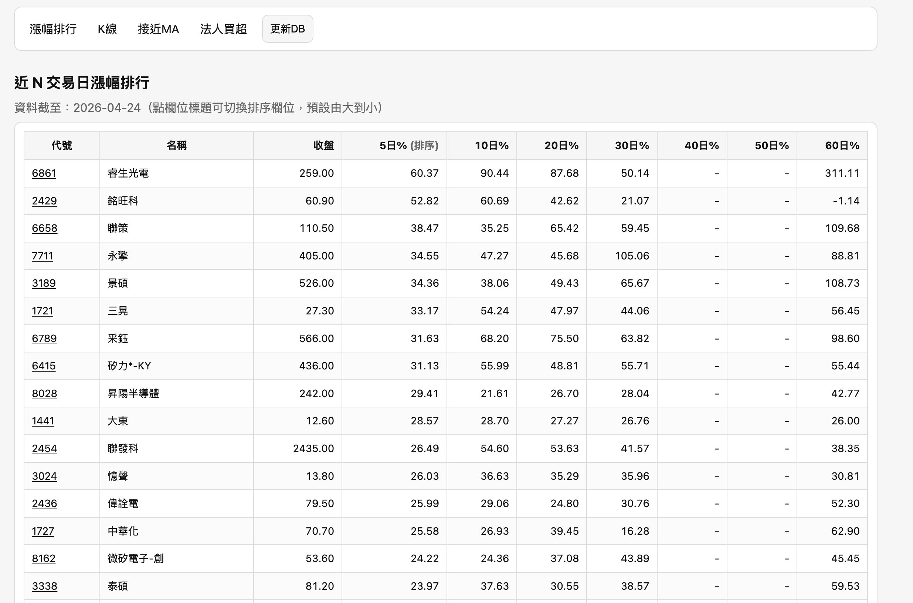
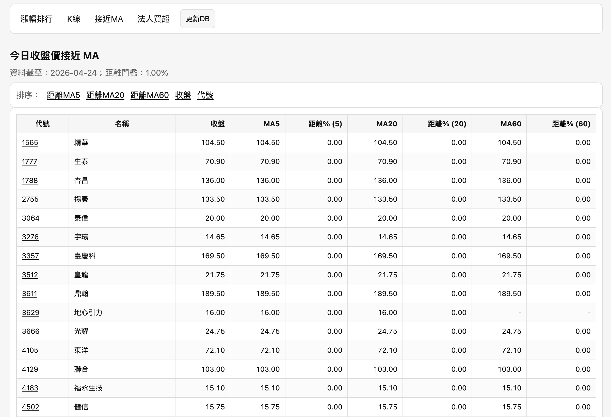
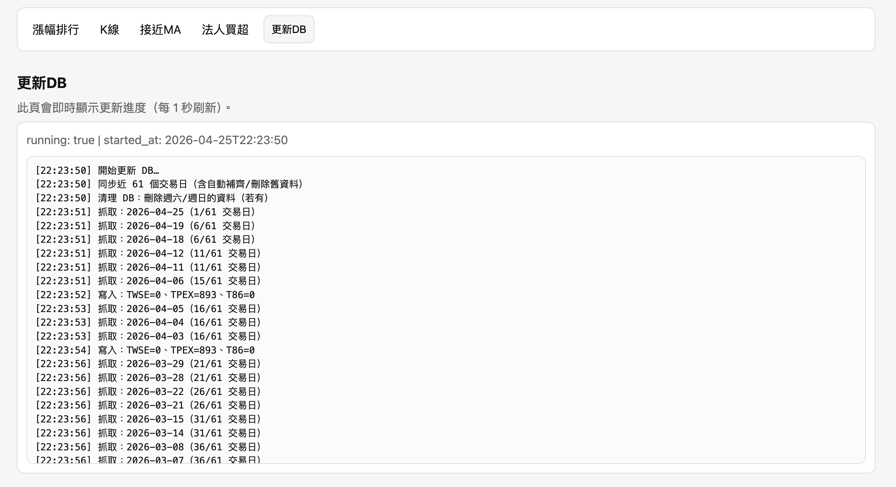
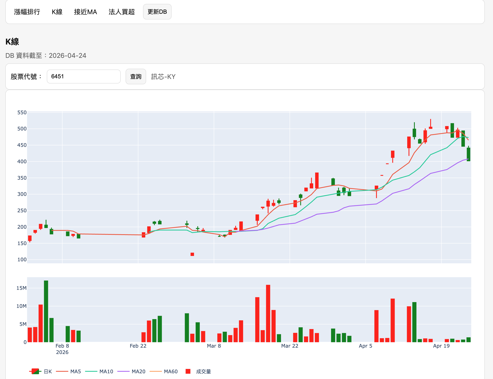
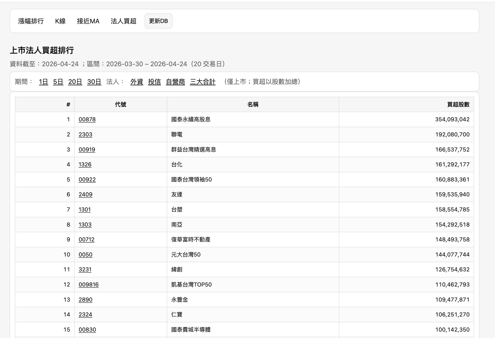

# stock_ui

Repo：
- https://github.com/samwang1228/stock_rank_web.git

## 需求

- Python 3.11+（建議）

## 安裝與執行（建議用 venv）

```bash
git clone https://github.com/samwang1228/stock_rank_web.git
cd stock_rank_web

# 建立虛擬環境
python -m venv .venv

# 啟用虛擬環境（macOS/Linux）
source .venv/bin/activate

# Windows PowerShell
# .venv\Scripts\Activate.ps1

python -m pip install -r requirements.txt
python app.py
```

這個資料夾提供：

- Web UI（Flask）：漲幅排行、K 線、接近 MA
- CLI 腳本：簡單篩選（保留）

資料來源：
- TWSE（上市）：每日收盤行情(全部)
- TPEx（上櫃）：上櫃股票行情

## 使用方式

- 啟動後開啟任一頁面，再按導覽列的「更新DB」按鈕開始抓資料/補齊缺漏。

## Web（Flask）

啟動：

```bash
python app.py
```

如果 5000 被占用：

```bash
PORT=5001 python app.py
```

打開：
- http://127.0.0.1:5000/gainers
- http://127.0.0.1:5000/kline
- http://127.0.0.1:5000/near-ma
- http://127.0.0.1:5000/inst

## Screenshots

### 漲幅排行



### 接近 MA



### 更新 DB（進度/Log）



### K 線



### 法人買超（上市）



資料會存到 `data/stock.db`（SQLite）。啟動後請按導覽列的「更新DB」按鈕，才會進行：
- 自動偵測從今天往回補齊缺漏（抓取間有延遲避免被封）
- 自動刪掉舊資料（保留最近 61 個交易日；這樣才能算到 60 日漲幅：今日 vs 60 個交易日前）

小提醒：不要同時跑兩個不同 port 的 Flask（例如 5000/5001），不然你可能會看到不同版本的頁面結果。

### 1) 接近 20MA / 60MA

```bash
python stock_screener.py near-ma --date 2026-04-23 --threshold-pct 1.0 --top 50
```

### 2) 近 N 交易日漲幅排行

```bash
python stock_screener.py gainers --date 2026-04-23 --lookback-days 5 --top 50
```

## 快取

預設會把每日 JSON 存在 `.cache/`，避免每次重跑都重新下載。
若要強制重抓：加 `--no-cache`。

## 憑證問題（若你用系統 python3）

如果你用 `python3` 遇到 `CERTIFICATE_VERIFY_FAILED`，最簡單的解法是改用 conda 環境的 Python。
在你了解風險的前提下，也可以暫時關閉驗證：

```bash
STOCK_SCREENER_INSECURE=1 python3 stock_screener.py near-ma --date 2026-04-23
```

## 可選環境變數

- `PORT`：Flask 監聽 port（預設 5000）
- `STOCK_DB_PATH`：SQLite 路徑（預設 `data/stock.db`）
- `STOCK_CACHE_DIR`：下載快取資料夾（預設 `.cache/`）
- `STOCK_FETCH_DELAY`：每日補資料時每個交易日寫入後的延遲秒數（預設 1.2，另含隨機 jitter）
- `STOCK_SCREENER_INSECURE=1`：在你了解風險前提下，暫時關閉 HTTPS 憑證驗證
