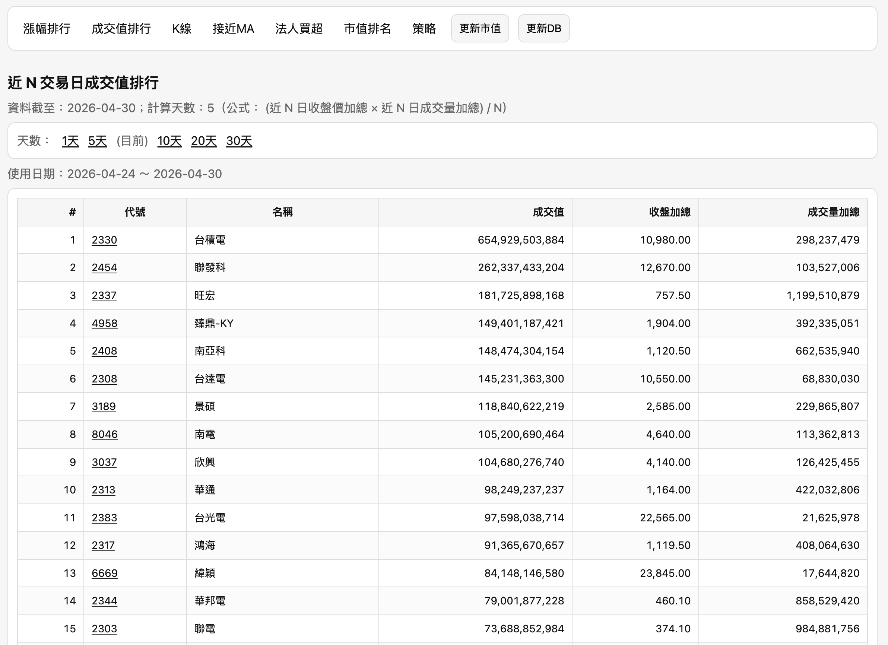
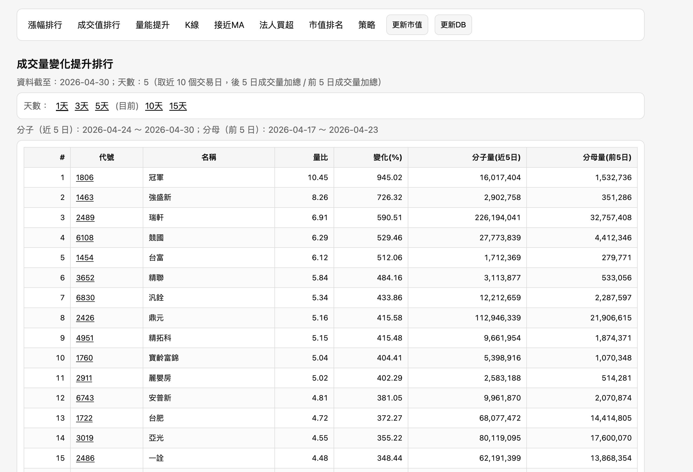
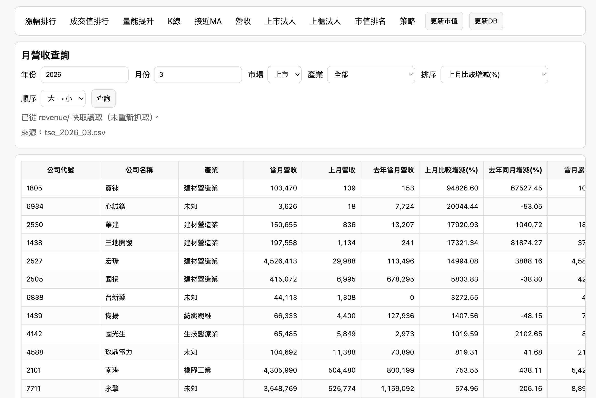

# Stock Dog (股狗)

Repo：
- https://github.com/samwang1228/stock_rank_web.git

## 需求

- Python 3.11+（建議）

## 安裝與執行（建議用 venv）

```bash
git clone https://github.com/samwang1228/stock_rank_web.git
cd stock_rank_web

# 建立虛擬環境
python -m venv .venv

# 啟用虛擬環境（macOS/Linux）
source .venv/bin/activate

# Windows PowerShell
# .venv\Scripts\Activate.ps1

python -m pip install -r requirements.txt
python app.py
```

如果你已經有 conda 環境（例如本機的 `stock`）：

```bash
/Users/wangshaocheng/anaconda3/envs/stock/bin/python -m pip install -r requirements.txt
PORT=5001 /Users/wangshaocheng/anaconda3/envs/stock/bin/python app.py
```

## 功能說明：

- Web UI（Flask）：
1. 漲幅排行：提供不同天數台股漲幅排名股票
2. 成值排行：為方便計算本系統採用 `收盤價 x 成交量` 
3. 成交量變化排行排名
4. K 線：畫近60天交易日的個股K線
5. 接近 MA：列出目前股價接近不同天數均線的股票
6. 當月營收排行: 可以根據YoY MoM進行排序顯示
7. 法人買超：提供不同天數台股法人買超排名
8. 市值排名：提供台股市值排行
9. 策略：可以根據上述策略找出符合共通條件的股票
- CLI 腳本：簡單篩選（保留）

## 資料來源：
- TWSE（上市）：每日收盤行情(全部)
- TPEx（上櫃）：上櫃股票行情
- TWSE OpenAPI：公司基本資料（用於取得已發行股數，計算市值快照）
- yfiance：上櫃股票會有資料缺失的情況此時用yfiance補足

## 使用方式

- 啟動後開啟任一頁面，再按導覽列的「更新DB」按鈕開始抓資料/補齊缺漏。
- 市值排名是「低頻更新」的獨立快照：需要另外按導覽列的「更新市值」按鈕。

更新 DB 的同步規則：
- 週末/休市日（例如國定假日、勞動節）會自動跳過，不會寫入成交易日
- 若 DB 已經有某天行情資料，會直接跳過該日，不會再重打 request

如果 DB 已經壞掉（例如 K 線只剩幾天、或資料明顯缺漏），最簡單的方式是刪掉 DB 後重抓一次：

```bash
rm -f data/stock.db
```

然後重啟服務、再按一次「更新DB」。

## Web（Flask）

啟動：

```bash
python app.py
```

如果 5000 被占用：

```bash
# 查詢
sudo lsof -i -P -n | grep LISTEN
# 使用5001 port啟動
PORT=5001 python app.py
```

打開：
- http://127.0.0.1:5000/gainers
- http://127.0.0.1:5000/turnover
- http://127.0.0.1:5000/kline
- http://127.0.0.1:5000/near-ma
- http://127.0.0.1:5000/revenue
- http://127.0.0.1:5000/inst
- http://127.0.0.1:5000/market-cap
- http://127.0.0.1:5000/strategy

## Screenshots

### 漲幅排行


### 成值排行


### 成交量變化


### 接近 MA


### 營收變化排行


### 更新 DB（進度/Log）


### K 線


### 法人買超（上市）


### 市值排名（上市）


### 策略（AND 交集）


資料會存到 `data/stock.db`（SQLite）。啟動後請按導覽列的「更新DB」按鈕，才會進行：
- 自動偵測從今天往回補齊缺漏（抓取間有延遲避免被封）
- 自動刪掉舊資料（保留最近 61 個交易日；這樣才能算到 60 日漲幅：今日 vs 60 個交易日前）

市值排名（/market-cap）使用獨立資料表（快照），不會跟著每天同步自動更新：
- 請按導覽列「更新市值」建立/刷新快照
- 市值計算方式：已發行股數 × 最新交易日收盤價（以 DB 最新交易日為準）

策略頁（/strategy）支援三個條件做 AND 交集：
- 漲幅：N 天漲幅 Top K
- 法人買超：M 天買超 Top K（外資 / 投信 / 自營商 / 外資+投信）
- 市值：市值 Top L

任一欄位留空代表不採用該條件；若你選了市值條件但尚未建立市值快照，頁面會提示先按「更新市值」。

小提醒：不要同時跑兩個不同 port 的 Flask（例如 5000/5001），不然你可能會看到不同版本的頁面結果。

### 1) 接近 20MA / 60MA

```bash
python stock_screener.py near-ma --date 2026-04-23 --threshold-pct 1.0 --top 50
```

### 2) 近 N 交易日漲幅排行

```bash
python stock_screener.py gainers --date 2026-04-23 --lookback-days 5 --top 50
```

## 快取

預設會把每日 JSON 存在 `.cache/`，避免每次重跑都重新下載。
若要強制重抓：加 `--no-cache`。

## 憑證問題（若你用系統 python3）

如果你用 `python3` 遇到 `CERTIFICATE_VERIFY_FAILED`，最簡單的解法是改用 conda 環境的 Python。
在你了解風險的前提下，也可以暫時關閉驗證：

```bash
STOCK_SCREENER_INSECURE=1 python3 stock_screener.py near-ma --date 2026-04-23
```

## 可選環境變數

- `PORT`：Flask 監聽 port（預設 5000）
- `STOCK_DB_PATH`：SQLite 路徑（預設 `data/stock.db`）
- `STOCK_CACHE_DIR`：下載快取資料夾（預設 `.cache/`）
- `STOCK_FETCH_DELAY`：每日補資料時每個交易日寫入後的延遲秒數（預設 1.2，另含隨機 jitter）
- `STOCK_SCREENER_INSECURE=1`：在你了解風險前提下，暫時關閉 HTTPS 憑證驗證
